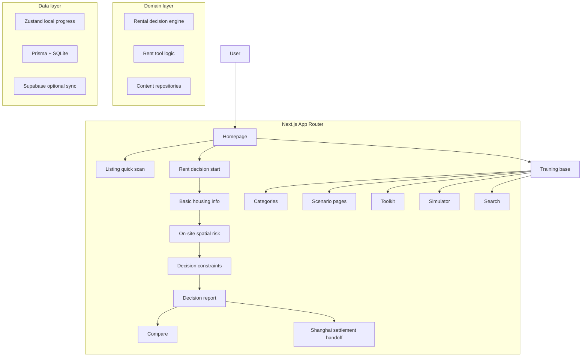

<div align="center">

# Young Study

**A product-style open source app that helps young people make better real-world decisions instead of just consuming more information.**

Built for university students, fresh graduates, and young adults entering real life for the first time.  
The current core flow focuses on **Shanghai first-time rental decisions -> settlement handoff**, turning judgment, checklists, scripts, reports, and next-step actions into one product chain.

[](https://github.com/b1ue13e/fengshui-lens/stargazers)
[](https://github.com/b1ue13e/fengshui-lens/network/members)
[](https://github.com/b1ue13e/fengshui-lens/issues)
[](https://github.com/b1ue13e/fengshui-lens/actions/workflows/engine-test.yml)
[](https://nextjs.org/)
[](https://react.dev/)
[](https://www.typescriptlang.org/)
[](https://tailwindcss.com/)
[](#)

<p>
  <a href="#screenshots"><strong>Screenshots</strong></a> ·
  <a href="#quick-start"><strong>Quick Start</strong></a> ·
  <a href="#architecture"><strong>Architecture</strong></a> ·
  <a href="./ROADMAP.md"><strong>Roadmap</strong></a> ·
  <a href="./CONTRIBUTING.md"><strong>Contributing</strong></a>
</p>

</div>

---

## Landing pitch

Most life-advice products give people more content.  
**Young Study is trying to give them better judgment.**

Instead of acting like a portal, a content farm, or a generic tool dump, this project is designed around one question:

> **How do we help young people make fewer expensive mistakes when they face real life for the first time?**

The current answer starts with one sharp product slice:

- enter from the homepage
- make a structured rental decision
- get a report with risks and next actions
- compare two options if needed
- continue into Shanghai settlement handoff after the decision is made

That product shape is what makes this repository interesting.

---

## Screenshots

<table>
  <tr>
    <td width="50%">
      
    </td>
    <td width="50%">
      
    </td>
  </tr>
  <tr>
    <td colspan="2">
      
    </td>
  </tr>
</table>

---

## Core product flow

### 1. Homepage
The homepage is intentionally narrowed around one primary job:

- rental-first entry
- brand visible early
- Shanghai handoff clearly secondary, not competing with the main task

### 2. Rent decision flow
Current main flow:

1. `/rent/tools`
2. `/rent/tools/analyze`
3. `/rent/tools/evaluate`
4. `/rent/tools/evaluate/basic`
5. `/rent/tools/evaluate/space`
6. `/rent/tools/evaluate/living`
7. `/rent/tools/report`
8. `/rent/tools/report/[id]`
9. `/rent/tools/compare`

### 3. Settlement handoff
After the user decides to move to Shanghai:

- `/survival-plans/start`
- `/resources`

### 4. Training base layer
Longer-term training surfaces:

- `/categories`
- `/categories/[slug]`
- `/scenario/[slug]`
- `/paths`
- `/toolkit`
- `/simulator`
- `/search`

---

## Architecture



---

## Tech stack

- Next.js 16 App Router
- React 19
- TypeScript
- Tailwind CSS 4
- shadcn/ui
- Zustand
- Prisma + SQLite
- Supabase SSR (optional)
- Vitest
- Playwright

---

## Quick start

```bash
npm install
npm run dev
```

Default local URL:

- http://localhost:3000

Production build:

```bash
npm run build
npm run start
```

---

## Contributing

If you want to contribute, start here:

- [CONTRIBUTING.md](./CONTRIBUTING.md)
- [ROADMAP.md](./ROADMAP.md)

Good contributions are not just about adding features. They should make the core flow sharper, clearer, and more product-like.

---

## The 10k stars ambition

This repository probably does not reach 10k stars by becoming bigger.  
It only gets there if it becomes:

- clearer
- more opinionated
- more product-shaped
- more memorable
- more obviously useful the moment someone lands on the repo

That is the standard this project is aiming for.