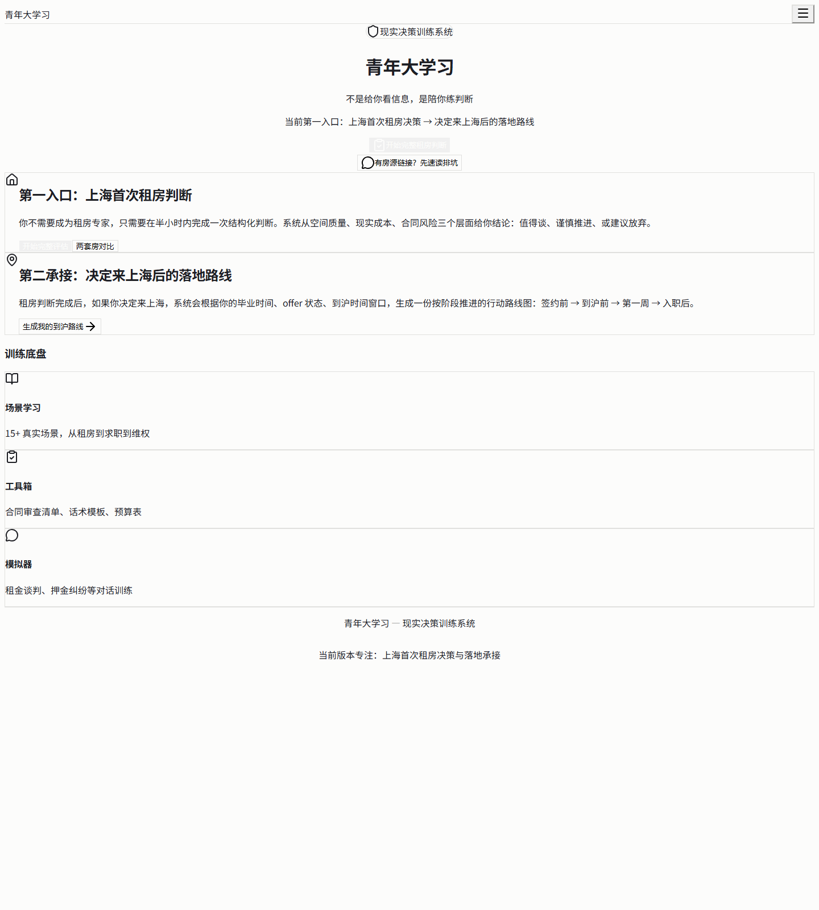
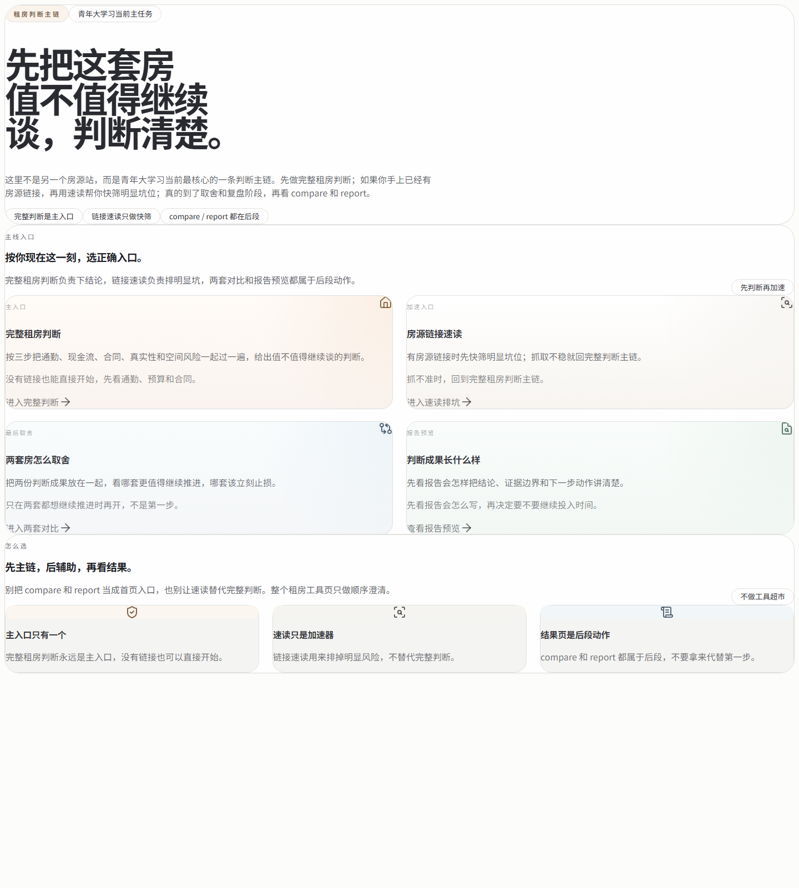
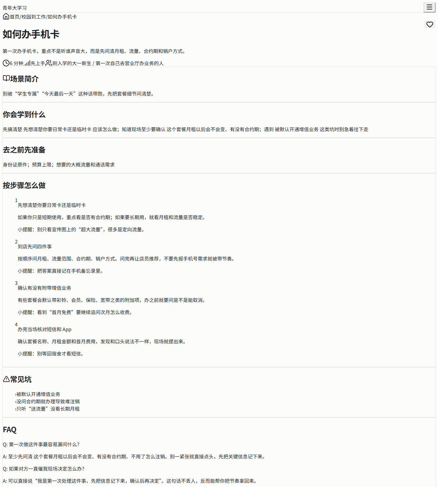
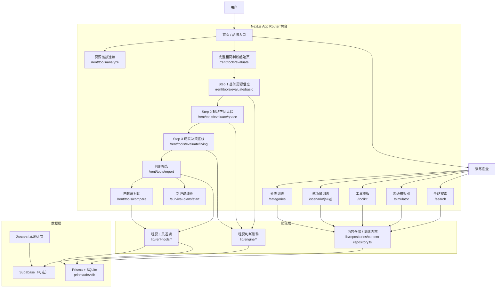

<div align="center">

# 青年大学习

**不是给年轻人更多信息，而是陪他们练会第一次面对社会现实时的判断。**

面向大学生、应届生和初入社会年轻人的 **现实决策训练产品**。  
当前主线聚焦 **上海首次租房判断 → 到沪落地承接**，把判断、清单、话术、报告和后续动作接成一条真正能落地的产品链路。

[](https://github.com/b1ue13e/fengshui-lens/stargazers)
[](https://github.com/b1ue13e/fengshui-lens/network/members)
[](https://github.com/b1ue13e/fengshui-lens/issues)
[](https://github.com/b1ue13e/fengshui-lens/actions/workflows/engine-test.yml)
[](https://nextjs.org/)
[](https://react.dev/)
[](https://www.typescriptlang.org/)
[](https://tailwindcss.com/)
[](#)

<p>
  <a href="#产品截图"><strong>看截图</strong></a> ·
  <a href="#快速开始"><strong>快速开始</strong></a> ·
  <a href="#产品架构图"><strong>看架构</strong></a> ·
  <a href="./ROADMAP.md"><strong>看 Roadmap</strong></a> ·
  <a href="./CONTRIBUTING.md"><strong>参与贡献</strong></a> ·
  <a href="https://github.com/b1ue13e/fengshui-lens/issues"><strong>提需求 / 报问题</strong></a>
</p>

</div>

---

## Hero

> 目标不是做一个“内容站”，而是做一个能让用户 **少踩真坑、少靠猜、能继续行动** 的现实决策产品。  
> 我的目标很直接：把这套产品打磨成一个值得拿到 **10k stars** 的中文产品型开源项目。

### 当前版本一句话

**先帮用户判断这套房值不值得继续谈，再把来上海后的真实落地动作接上。**

### 当前第一主线

- 首页：聚焦租房主入口，不做资源广场
- 链接速读：快速排掉明显坑位
- 完整判断：按 3 步完成一次结构化租房决策
- 判断报告：给出继续谈 / 谨慎推进 / 建议放弃
- 房源对比：把两套房放在一张桌上做取舍
- 到沪承接：把住处、材料、第一周动作接住

---

## 产品截图

> 当前前台 UI 已按 Kimi 参考稿重构，截图来自本地生产预览。

<table>
  <tr>
    <td width="50%">
      
    </td>
    <td width="50%">
      
    </td>
  </tr>
  <tr>
    <td colspan="2">
      
    </td>
  </tr>
</table>

---

## 产品架构图



---

## 为什么这个项目值得做

### 它不是泛知识库
它不追求“内容很多”，而追求：

- 先把判断顺序讲清楚
- 先把最容易后悔的点挑出来
- 先让用户知道下一步去问什么、做什么

### 它不是工具堆砌
它不想变成“功能越来越多、但入口越来越乱”的产品。  
首页始终应该优先服务一个主任务：**租房判断**。

### 它在做产品化的现实训练
这个项目更像：

- 决策链路设计
- 信息架构收口
- 工具和内容的承接关系设计
- 风险表达与行动建议的产品化输出

---

## 当前核心能力

- 首页租房优先入口
- 房源链接速读排坑
- 三步完整租房判断流程
- 判断报告 / 对比 / 后续动作建议
- 到沪路线图承接
- 分类训练 / 场景训练页
- 工具模板 / 清单 / 话术
- 沟通模拟器
- 本地优先存储
- Supabase 可选同步

---

## 快速开始

### 1. 安装依赖

```bash
npm install
```

### 2. 启动开发环境

```bash
npm run dev
```

默认地址：

- [http://localhost:3000](http://localhost:3000)

### 3. 生产构建与启动

```bash
npm run build
npm run start
```

---

## 常用命令

```bash
npm run lint
npm run test:run
npm run build
npm run smoke:routes
```

补充：

```bash
npm run test:e2e
npm run test:disputed
npm run test:fight
```

---

## 技术栈

- Next.js 16 App Router
- React 19
- TypeScript
- Tailwind CSS 4
- shadcn/ui
- Zustand
- Prisma + SQLite
- Supabase SSR（可选）
- Vitest
- Playwright（预览 / E2E）

---

## 当前产品主线

### 首页
首页优先把用户送进 **租房判断主链**，而不是把资源平铺成门户。

### 租房判断主链
当前主线是：

1. ` /rent/tools `：租房主入口
2. ` /rent/tools/analyze `：房源链接速读排坑
3. ` /rent/tools/evaluate `：完整租房判断起始页
4. ` /rent/tools/evaluate/basic `：基础房源信息
5. ` /rent/tools/evaluate/space `：现场空间风险
6. ` /rent/tools/evaluate/living `：现实决策底线
7. ` /rent/tools/report `：判断成果示例页
8. ` /rent/tools/report/[id] `：真实判断成果页
9. ` /rent/tools/compare `：两套房源对比

### 到沪承接
当用户已经决定来上海后，再进入：

- ` /survival-plans/start `
- ` /resources `

### 训练底盘
后续训练入口包括：

- ` /categories `：分类训练
- ` /categories/[slug] `：分类详情
- ` /scenario/[slug] `：单场景训练页
- ` /paths `：学习路径
- ` /toolkit `：工具模板
- ` /simulator `：沟通模拟器
- ` /search `：全站搜索

---

## 数据与存储

### 本地默认可运行
不配置云端也能跑：

- 内容走本地种子
- 用户进度走浏览器本地存储
- 租房判断结果可落到本地 SQLite

### SQLite / Prisma
本地数据库文件：

- `prisma/dev.db`

### Supabase（可选）
如果配置了 Supabase：

- 用户进度和反馈可同步到云端
- 内容读取可切换为 remote 模式

---

## 环境变量

最小可选配置：

```bash
NEXT_PUBLIC_APP_URL=http://localhost:3000
NEXT_PUBLIC_SUPABASE_URL=...
NEXT_PUBLIC_SUPABASE_ANON_KEY=...
SUPABASE_CONTENT_SOURCE=local
```

说明：

- `SUPABASE_CONTENT_SOURCE=local`：只同步用户进度 / 反馈，内容仍走本地种子
- `SUPABASE_CONTENT_SOURCE=remote`：内容也从 Supabase 读取
- `ENABLE_INTERNAL_PAGES=false`：生产环境默认隐藏 `/design` 和 `/dev/*`

---

## 推荐提交流程

提交前建议至少执行：

```bash
npm run lint
npm run build
```

如需额外确认路由：

```bash
npm run smoke:routes
```

---

## 当前产品边界

当前版本**认真支持**的是：

- 上海首次租房判断
- 判断后的到沪承接
- 与租房 / 初入社会有关的高频训练场景

当前**不假装支持**：

- 全国城市深度定制
- 完整房源平台能力
- 全量政策数据库

---

## 目录提示

高频前台页面主要在：

- `app/page.tsx`
- `app/rent/tools/*`
- `app/(app)/categories/*`
- `app/(app)/scenario/*`
- `app/search/page.tsx`
- `components/home/*`
- `components/search/*`
- `components/scenario/*`

租房判断相关逻辑主要在：

- `lib/engine/*`
- `lib/rent-tools/*`
- `lib/repositories/rent-tool-repository.ts`

---

## 备注

- 用户可见品牌统一为 **青年大学习**
- 当前 UI 已明显向 Kimi 参考稿靠拢，并包含一部分直接照搬的页面结构
- 当前目标不是做“一个更大的内容站”，而是把这条主线打磨成一个真正值得传播和 star 的产品型仓库
